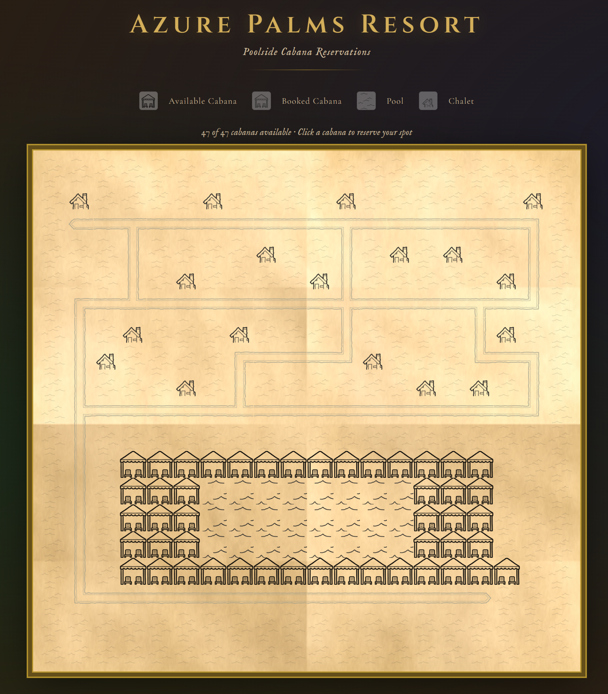

# Azure Palms Resort — Cabana Booking

An interactive poolside cabana booking webapp for luxury resorts. Guests browse a visual tile map of the resort, see real-time cabana availability, and reserve their spot in one step.



---

## Quick Start

```bash
./run.sh
```

Then open **http://localhost:3000** in your browser.

### Custom map or bookings files

```bash
./run.sh --map /path/to/map.ascii --bookings /path/to/bookings.json
```

Optional port overrides:

```bash
./run.sh --api-port 4001 --frontend-port 4000
```

**Requirements:** Node.js 18+

---

## How to Run Tests

### Backend (unit + integration)

```bash
npm test
```

Runs Jest tests against the Express API using `supertest`. Tests cover: map parsing, booking validation, guest authentication, double-booking prevention, and error responses.

### Frontend (end-to-end)

```bash
npx playwright install --with-deps chromium
npx playwright test
```

Runs Playwright tests against the running app (auto-starts if not already running). Tests cover: map rendering, modal open/close, booking form validation, successful booking flow, and booked-cabana display.

---

## Project Structure

```
resort-cabana/
├── backend/
│   └── server.js          # Express API (createApp factory)
├── frontend/
│   ├── index.html         # Single-page app (Vanilla JS)
│   ├── script.js          # Client-side logic & rendering
│   └── assets/            # Tile images (cabana, pool, paths, etc.)
├── tests/
│   ├── api.test.js        # Jest backend tests
│   └── e2e/
│       └── ui.test.js     # Playwright frontend tests
├── map.ascii              # Default resort map
├── bookings.json          # Default guest list
├── start.js               # Unified entrypoint (starts API + static server)
├── run.sh                 # Shell entrypoint (installs deps + starts)
├── jest.config.js
└── playwright.config.js
```

---

## API Reference

| Method | Path        | Description                        |
|--------|-------------|------------------------------------|
| GET    | `/api/map`  | Returns grid + cabana states       |
| POST   | `/api/book` | Book a cabana (room + guestName)   |

### POST `/api/book` body

```json
{
  "cabanaId": "11_3",
  "room": "101",
  "guestName": "Alice Smith"
}
```

### Error responses

| Status | Meaning                            |
|--------|------------------------------------|
| 400    | Missing required fields            |
| 401    | Room not found / name mismatch     |
| 404    | Cabana ID not found                |
| 409    | Cabana already booked              |

---

## Map Legend

| Symbol | Meaning |
|--------|---------|
| `W`    | Cabana (bookable) |
| `p`    | Pool |
| `#`    | Path |
| `c`    | Chalet |
| `.`    | Empty space |

---

## Design Decisions & Trade-offs

**Single-page, no framework.** The frontend is plain HTML + Vanilla JS with no build step. This keeps the setup friction-free for reviewers and keeps the code easy to follow without framework knowledge. The trade-off is slightly more verbose DOM manipulation, acceptable for this scope.

**Backend as pure Express with a `createApp` factory.** Separating `createApp` from the `listen` call makes the backend trivially testable with `supertest` without starting a real server. The factory receives file paths at construction time, enabling full isolation per test.

**In-memory bookings.** Cabana bookings are stored in a plain JS object on the backend. This is intentionally simple — no database setup, no migrations, restarts clear all bookings. Sufficient for a demo/review context; a real system would use a database with transactions to prevent race conditions.

**No sessions or auth tokens.** The spec states that knowing room number + guest name is sufficient. The backend validates these on every booking request against the loaded guest list. No cookies or tokens are issued.

**Static frontend served by Express.** Rather than requiring a separate static server (nginx, http-server, etc.), a minimal Express static server is started alongside the API in `start.js`. This keeps the single-command requirement satisfied without Docker or a process manager.

**Tile rendering via CSS classes + `` tags.** Each ASCII cell maps to a CSS class that applies the correct asset image. Path tiles (`#`) use neighbor-detection logic to select the correct directional arrow tile (straight, corner, crossing, end). This avoids pre-processing the map and keeps rendering logic client-side and declarative.

**Guest name matching is case-insensitive.** Guests shouldn't be rejected for typing "alice smith" vs "Alice Smith". Both are accepted.
